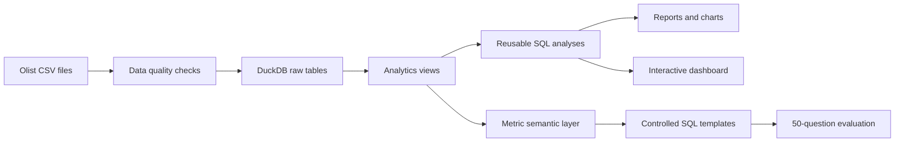

<p align="right"><strong>English</strong> | <a href="README.zh-CN.md">中文</a></p>

# E-commerce Analytics Copilot

An analytics-first portfolio project built on the Olist public e-commerce dataset. It combines reproducible business analysis, a DuckDB semantic layer, an interactive dashboard, and a controlled natural-language analytics copilot with an offline evaluation suite.


> The analytics is the core product. The Copilot is a transparent, controlled semantic-routing prototype—not a general-purpose LLM—and is evaluated for answer correctness, SQL execution, safety, and latency.

## Project highlights

| Area | Result | Business interpretation |
|---|---:|---|
| Growth | Jan–Aug 2018 GMV grew **138.3% YoY** | Growth was driven by order volume (+137.3%), not AOV (+0.4%) |
| Category | Top 5 categories contributed **44.4%** of net growth | Growth is concentrated but not dependent on one category |
| Geography | São Paulo contributed **43.4%** of net growth | Regional strategy should balance scale and fulfillment risk |
| Fulfillment | State late-delivery rate vs. review score: **r = -0.88** | Delivery performance is a strong service-quality signal |
| Customers | Repeat purchase rate **3.0%**; weighted M1 retention **0.48%** | The customer base is dominated by one-time buyers |
| Copilot | **97.8%** answer accuracy; **100%** safety accuracy | Controlled semantics outperformed the 24.4% keyword baseline |

[English](reports/00_portfolio_case_study.en.md) | [中文](reports/00_portfolio_case_study.md)


## What is included

- Data quality checks for completeness, keys, missing values, foreign keys, and payment reconciliation.
- DuckDB analytics views designed to prevent one-to-many join inflation.
- Monthly growth, category mix, regional fulfillment, seller concentration, and customer cohort analyses.
- A zero-dependency interactive dashboard with year and topic switching.
- A controlled natural-language-to-SQL layer with allowlisted metrics and read-only SQL templates.
- A 50-question regression set covering analytic accuracy, execution, safety, latency, and error analysis.
- Automated tests and reproducible CLI commands.

## Architecture



Key modeling decisions:

- Payments and reviews are aggregated to order grain before joining to the order table.
- GMV excludes freight; customers are identified with `customer_unique_id`.
- YoY comparisons use January–August 2017 and 2018 to keep periods comparable.
- Copilot queries are restricted to `SELECT`/`WITH`; supported years and Top-N values are validated.

## Explore the dashboard

The committed dashboard data is aggregated, so the dashboard can be viewed without downloading the raw dataset.

```bash
python -m http.server 8765 --directory dashboard
```

Open [http://localhost:8765](http://localhost:8765). Do not open `dashboard/index.html` through a `file://` URL because the browser may block loading `data.json`.

An optional Streamlit implementation is also included:

```bash
python -m pip install -e ".[app,dev]"
streamlit run dashboard/app.py
```

## Reproduce the full pipeline

### 1. Get the dataset

Download the [Brazilian E-Commerce Public Dataset by Olist](https://www.kaggle.com/datasets/olistbr/brazilian-ecommerce), extract its nine CSV files, and place them in `data/raw/`. Raw data is intentionally excluded from Git.

### 2. Install and run

```bash
python3 -m venv .venv
source .venv/bin/activate
python -m pip install -e ".[dev]"

ecommerce-copilot inspect
ecommerce-copilot build
ecommerce-copilot validate
ecommerce-copilot run-all
pytest -q
```

Run a Copilot query:

```bash
ecommerce-copilot ask "2018年GMV最高的前5个品类"
```

The individual CLI commands are:

| Command | Purpose |
|---|---|
| `inspect` | Inspect raw files and generate data-quality results |
| `build` | Load CSV data into DuckDB and build analytics views |
| `validate` | Validate grains, foreign keys, review aggregation, and payment totals |
| `analyze-overview` | Generate monthly KPI analysis |
| `analyze-category` | Generate category contribution and mix analysis |
| `analyze-deep-dives` | Generate region, seller, and customer analyses |
| `ask "question"` | Run a supported natural-language analytics query |
| `evaluate-copilot` | Run the 50-question offline evaluation |
| `export-dashboard` | Refresh dashboard data |
| `run-all` | Rebuild all reports, charts, evaluation results, and dashboard data |

## Repository structure

```text
config/                  Metric semantic-layer configuration
dashboard/               Static dashboard and optional Streamlit app
data/raw/                Local raw CSV files (Git-ignored)
data/processed/          Local DuckDB database (Git-ignored)
docs/                    Data dictionary, metrics, and project scope
eval/                    50-question Copilot evaluation set
reports/                 Curated reports and committed figures
reports/generated/       Rebuildable detailed CSV/JSON outputs (Git-ignored)
sql/analysis/            Reusable business-analysis SQL
sql/analytics/           Analytics-layer view definitions
src/ecommerce_copilot/   Python package and CLI
tests/                   Automated tests
```

## Analysis reports

- [Portfolio case study — English](reports/00_portfolio_case_study.en.md)
- [项目总报告 — 中文](reports/00_portfolio_case_study.md)
- [Data quality findings](reports/01_data_quality_findings.md)
- [Monthly business overview](reports/02_business_overview.md)
- [Category growth contribution](reports/03_category_growth.md)
- [Regional growth and fulfillment](reports/04_region_fulfillment.md)
- [Seller performance](reports/05_seller_performance.md)
- [Customer retention](reports/06_customer_retention.md)
- [Copilot offline evaluation](reports/07_copilot_evaluation.md)

Detailed reports 01–07 are currently written in Chinese; the bilingual case study summarizes their primary evidence and conclusions.

## Limitations

- The dataset has no impressions, clicks, ad spend, margin, or experiment exposure, so full-funnel conversion, ROI, and profit cannot be estimated.
- Fulfillment and review relationships are observational and should not be interpreted as causal.
- The current Copilot is a deterministic semantic-routing baseline. Its 97.8% accuracy applies only to the committed regression set and should not be presented as general LLM performance.

## License and data

Project code is available under the [MIT License](LICENSE). The Olist dataset is not redistributed by this repository; obtain it from its original source and follow the source terms.
