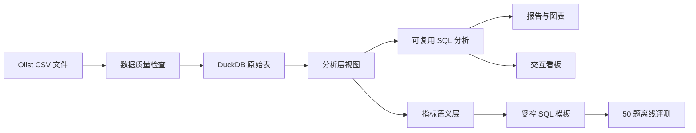

<p align="right"><a href="README.md">English</a> | <strong>中文</strong></p>

# 电商经营数据分析 Copilot

这是一个基于 Olist 公开电商数据集、以数据分析为主体的完整项目。项目涵盖可复现的经营分析、DuckDB 指标语义层、交互看板，以及带离线评测的受控自然语言数据分析 Copilot。


> 数据分析是项目主体。Copilot 是透明、可控的语义路由原型，不是通用大模型；项目对其答案正确性、SQL 执行、安全性和延迟进行了独立评测。

## 核心结果

| 分析主题 | 结果 | 业务含义 |
|---|---:|---|
| 经营增长 | 2018 年 1–8 月 GMV 同比增长 **138.3%** | 增长由订单量（+137.3%）驱动，而非客单价（+0.4%） |
| 品类 | 前五品类贡献净增量的 **44.4%** | 增长相对集中，但不存在单一品类依赖 |
| 地区 | SP 州贡献净增量的 **43.4%** | 地区策略需要同时考虑规模和履约风险 |
| 履约 | 州级延迟率与评分相关系数 **-0.88** | 履约表现是服务体验的重要信号 |
| 用户 | 复购率 **3.0%**，加权 M1 留存 **0.48%** | 用户结构以一次性购买为主 |
| Copilot | 答案准确率 **97.8%**，安全准确率 **100%** | 受控语义层显著优于 24.4% 的关键词基线 |

[阅读中文项目总报告](reports/00_portfolio_case_study.md) · [Read the English case study](reports/00_portfolio_case_study.en.md)


## 项目包含什么

- 检查数据完整性、主键、缺失值、外键和支付金额对账。
- 使用 DuckDB 建立分析宽表，避免一对多连接造成 GMV 重复计算。
- 完成经营增长、品类结构、地区履约、商家集中度和用户队列分析。
- 提供支持年份和专题切换的零额外依赖交互看板。
- 建立指标白名单、只读 SQL 模板和参数限制的自然语言取数层。
- 使用 50 道回归问题评测准确率、执行成功率、安全性、延迟和错误类型。
- 提供自动化测试和可复现的命令行工作流。

## 技术架构



关键设计：

- 付款和评价先聚合到订单粒度，再与订单表连接。
- GMV 不含运费；用户使用 `customer_unique_id` 标识。
- 同比统一比较 2017 和 2018 年 1–8 月，保证时间口径一致。
- Copilot 只允许 `SELECT`/`WITH` 查询，并限制可用年份和 Top N 范围。

## 打开交互看板

仓库中提交的是聚合后的看板数据，因此不下载原始数据也可以直接查看看板。

```bash
python -m http.server 8765 --directory dashboard
```

浏览器打开 [http://localhost:8765](http://localhost:8765)。不要通过 `file://` 直接打开 `dashboard/index.html`，否则浏览器可能阻止读取 `data.json`。

项目还提供可选的 Streamlit 版本：

```bash
python -m pip install -e ".[app,dev]"
streamlit run dashboard/app.py
```

## 从头复现分析

### 1. 准备数据

下载 [Brazilian E-Commerce Public Dataset by Olist](https://www.kaggle.com/datasets/olistbr/brazilian-ecommerce)，解压后将九个 CSV 文件放入 `data/raw/`。原始数据不会提交到 Git。

### 2. 安装并运行

```bash
python3 -m venv .venv
source .venv/bin/activate
python -m pip install -e ".[dev]"

ecommerce-copilot inspect
ecommerce-copilot build
ecommerce-copilot validate
ecommerce-copilot run-all
pytest -q
```

运行一个 Copilot 问题：

```bash
ecommerce-copilot ask "2018年GMV最高的前5个品类"
```

命令说明：

| 命令 | 用途 |
|---|---|
| `inspect` | 检查原始文件并生成数据质量结果 |
| `build` | 将 CSV 导入 DuckDB 并建立分析视图 |
| `validate` | 校验粒度、外键、评价聚合和支付金额 |
| `analyze-overview` | 生成月度经营指标分析 |
| `analyze-category` | 生成品类贡献和结构变化分析 |
| `analyze-deep-dives` | 生成地区、商家和用户专题分析 |
| `ask "问题"` | 运行支持范围内的自然语言取数 |
| `evaluate-copilot` | 执行 50 题离线评测 |
| `export-dashboard` | 刷新看板数据 |
| `run-all` | 重建全部报告、图表、评测和看板数据 |

## 仓库结构

```text
config/                  指标语义层配置
dashboard/               静态看板和可选 Streamlit 应用
data/raw/                本地原始 CSV（Git 忽略）
data/processed/          本地 DuckDB 数据库（Git 忽略）
docs/                    数据字典、指标口径和项目范围
eval/                    Copilot 50 题评测集
reports/                 精选报告和提交到仓库的图表
reports/generated/       可重新生成的 CSV/JSON 明细（Git 忽略）
sql/analysis/            可复用业务分析 SQL
sql/analytics/           分析层视图定义
src/ecommerce_copilot/   Python 包和命令行入口
tests/                   自动化测试
```

## 分析报告

- [项目总报告 — 中文](reports/00_portfolio_case_study.md)
- [Portfolio case study — English](reports/00_portfolio_case_study.en.md)
- [数据质量结论](reports/01_data_quality_findings.md)
- [月度经营分析](reports/02_business_overview.md)
- [品类增长贡献](reports/03_category_growth.md)
- [地区增长与履约](reports/04_region_fulfillment.md)
- [商家规模与履约](reports/05_seller_performance.md)
- [用户复购与队列留存](reports/06_customer_retention.md)
- [Copilot 离线评测](reports/07_copilot_evaluation.md)

## 项目限制

- 数据没有曝光、点击、广告成本、毛利或实验分组，因此无法估算完整转化漏斗、ROI 或利润。
- 履约与评分之间是观察性关系，不能解释为因果关系。
- 当前 Copilot 是确定性的语义路由基线；97.8% 准确率只适用于仓库中的回归集，不能作为通用大模型效果宣传。

## 许可证与数据

项目代码采用 [MIT License](LICENSE)。仓库不分发 Olist 原始数据，请从原始来源下载并遵守其使用条款。
