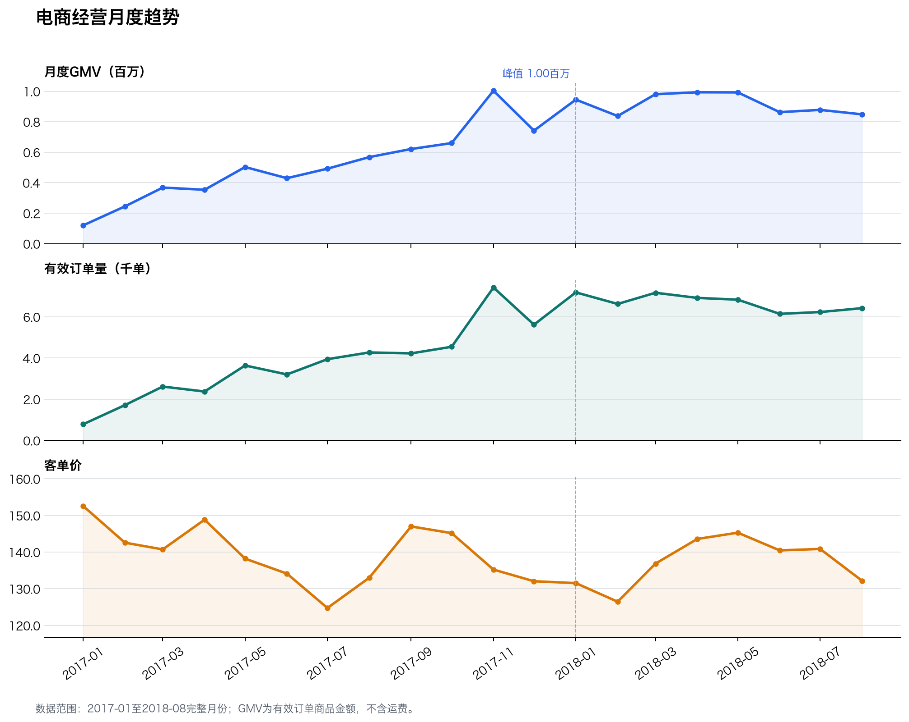
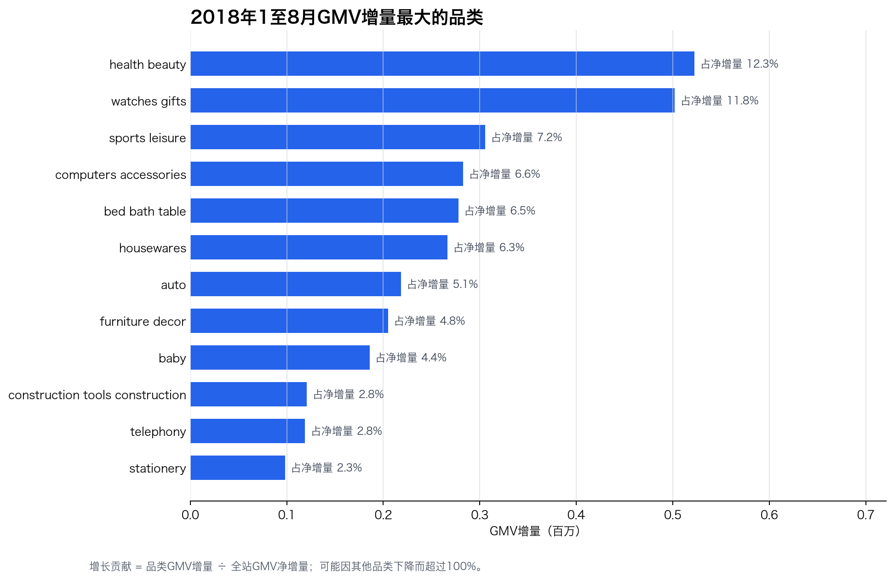
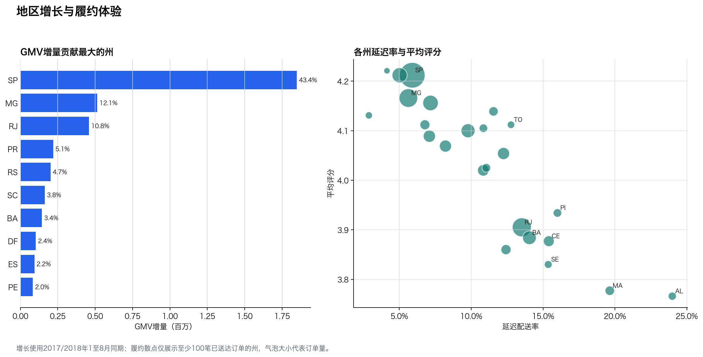
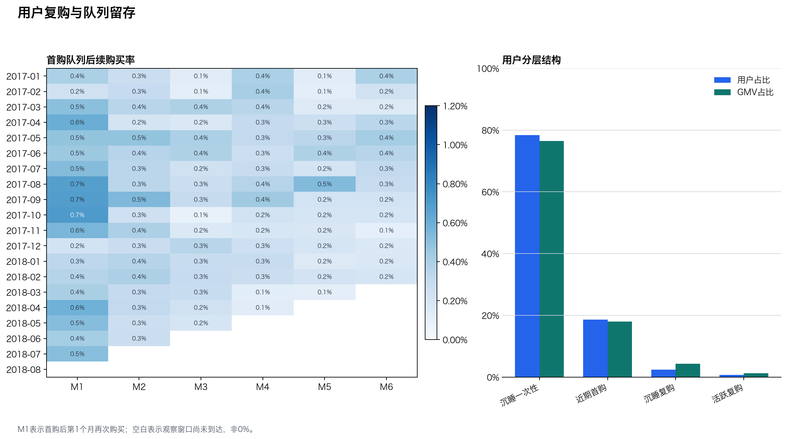

[English](00_portfolio_case_study.en.md) | **中文**

# 电商经营数据分析 Copilot：项目总报告

## 项目摘要

本项目以Olist公开电商订单数据为对象，先建立可追溯的分析数据底座和指标口径，再完成经营增长、品类、地区履约、商家和用户留存分析。在此基础上，项目加入可控语义层Copilot、交互看板和50题离线评测，评估自然语言取数的准确性与安全性。

## 核心结论

| 主题 | 核心结果 | 业务含义 |
|---|---|---|
| 经营增长 | 2018年1至8月GMV同比 138.3%，订单量同比 137.3%，客单价变化 0.4% | 增长主要由订单规模扩大驱动，不是客单价提升 |
| 品类 | health beauty贡献净增量的 12.3%，前五品类合计 44.4% | 增量来源有所集中，但单一品类依赖不高 |
| 地区 | SP州贡献净增量的 43.4%，前五州合计 76.1% | 增长地域集中度高，地区策略应区分规模与履约风险 |
| 履约 | AL州延迟率 24.0%；州级延迟率与评分相关系数 -0.88 | 优先治理大规模、高延迟的州和商家 |
| 商家 | Top 10商家GMV份额 13.2%，HHI 0.0036 | 头部依赖较低，运营重点是长尾商家分层和履约治理 |
| 用户 | 复购率 3.0%，M1留存 0.48% | 一次性购买占主导，优先验证首购后30天二购激励 |
| Copilot | 50题中答案准确率 97.8%，关键词基线 24.4%，安全拦截率 100.0% | 语义层与受控SQL模板能提高回归集稳定性 |









## 业务建议

1. 增长策略上，保持头部增量品类的供给与转化，同时监控份额下降品类，避免只看整体GMV。
2. 履约上，用“订单影响规模 × 延迟率 × 低评率”设置州和商家联合优先级。
3. 用户经营上，将首购后30天设为关键实验窗口，分品类测试二购激励和召回，使用增量实验评估。
4. Copilot产品化上，保留语义层、只读安全和回归评测，再接入真实大模型并对未见问题单独验证。

## 技术与分析设计

```text
Olist CSV -> 数据质量检查 -> DuckDB raw层 -> analytics宽表
          -> SQL专题分析 -> Python报告/图表 -> 交互看板
          -> 指标语义层 -> 自然语言路由 -> 受控SQL -> 50题评测
```

- 数据建模：先将付款和评价聚合到订单粒度，再与订单主表连接，防止GMV重复计算。
- 指标口径：GMV不含运费；用户使用customer_unique_id；履约只在可比已送达订单中计算。
- 时间可比：增长分析统一使用2017年和2018年1至8月，排除稀疏或不完整月份。
- Copilot只生成SELECT/WITH查询，年份和Top N参数受限，不将用户原文插入SQL。

## 交付物导航

- [数据质量结论](01_data_quality_findings.md)
- [月度经营分析](02_business_overview.md)
- [品类增长贡献](03_category_growth.md)
- [地区增长与履约](04_region_fulfillment.md)
- [商家规模与履约](05_seller_performance.md)
- [用户复购与队列留存](06_customer_retention.md)
- [Copilot离线评测](07_copilot_evaluation.md)
- 交互看板：`dashboard/index.html`

## 限制

- 数据没有曝光、点击、加购、营销成本和毛利，不能计算完整转化漏斗、ROI或利润。
- 履约与评分分析是观察性的，相关性不代表因果。
- Copilot当前是可控语义路由基线，不应包装成通用大模型效果。

数据来源：[Brazilian E-Commerce Public Dataset by Olist](https://www.kaggle.com/datasets/olistbr/brazilian-ecommerce)。
