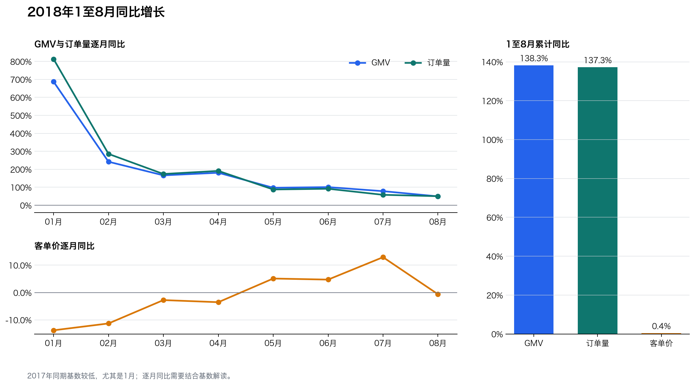

# 月度经营分析

## 结论摘要

2018年1至8月GMV为 7,341,037.41，较2017年同期增长 138.3%。有效订单量增长 137.3%，客单价变化 0.4%。增长主要来自订单规模扩大。

逐月GMV同比从2018年1月的 687.2% 回落至8月的 49.4%，8月订单量仍同比增长 50.3%。增速回落主要需要结合2017年低基数解释，不能等同于经营规模下降。

2018年各月客单价同比介于 -13.8% 至 12.9%，1至8月累计仅增长 0.4%。单看客单价，尚无持续提价的证据；商品结构是否变化需要下一步按品类拆解。

完整分析期的GMV峰值出现在 2017-11，达到 1,003,862.14，对应 7,423 笔有效订单。

最大环比增长出现在 2017-02，GMV增长 104.0%；最大环比下降出现在 2017-12，GMV下降 26.1%。大幅变化需要结合前月基数和季节性解释。

## 同期累计比较

| 期间 | GMV | 有效订单 | 客单价 |
|---|---:|---:|---:|
| 2017年1至8月 | 3,080,850.81 | 22,562 | 136.55 |
| 2018年1至8月 | 7,341,037.41 | 53,531 | 137.14 |
| 同比 | 138.3% | 137.3% | 0.4% |

## 月度指标

| 月份 | GMV | 有效订单 | 客单价 | GMV环比 | GMV同比 | 订单同比 |
|---|---:|---:|---:|---:|---:|---:|
| 2017-01 | 120,098.27 | 787 | 152.60 | n.a. | n.a. | n.a. |
| 2017-02 | 244,959.35 | 1,718 | 142.58 | 104.0% | n.a. | n.a. |
| 2017-03 | 368,341.32 | 2,617 | 140.75 | 50.4% | n.a. | n.a. |
| 2017-04 | 353,842.98 | 2,377 | 148.86 | -3.9% | n.a. | n.a. |
| 2017-05 | 503,159.19 | 3,640 | 138.23 | 42.2% | n.a. | n.a. |
| 2017-06 | 429,916.61 | 3,205 | 134.14 | -14.6% | n.a. | n.a. |
| 2017-07 | 492,287.30 | 3,946 | 124.76 | 14.5% | n.a. | n.a. |
| 2017-08 | 568,245.79 | 4,272 | 133.02 | 15.4% | n.a. | n.a. |
| 2017-09 | 621,415.91 | 4,227 | 147.01 | 9.4% | n.a. | n.a. |
| 2017-10 | 660,179.62 | 4,547 | 145.19 | 6.2% | n.a. | n.a. |
| 2017-11 | 1,003,862.14 | 7,423 | 135.24 | 52.1% | n.a. | n.a. |
| 2017-12 | 742,183.79 | 5,620 | 132.06 | -26.1% | n.a. | n.a. |
| 2018-01 | 945,456.29 | 7,187 | 131.55 | 27.4% | 687.2% | 813.2% |
| 2018-02 | 837,895.43 | 6,625 | 126.47 | -11.4% | 242.1% | 285.6% |
| 2018-03 | 981,051.06 | 7,168 | 136.87 | 17.1% | 166.3% | 173.9% |
| 2018-04 | 993,592.98 | 6,919 | 143.60 | 1.3% | 180.8% | 191.1% |
| 2018-05 | 992,871.75 | 6,833 | 145.31 | -0.1% | 97.3% | 87.7% |
| 2018-06 | 863,265.53 | 6,145 | 140.48 | -13.1% | 100.8% | 91.7% |
| 2018-07 | 878,044.27 | 6,233 | 140.87 | 1.7% | 78.4% | 58.0% |
| 2018-08 | 848,860.10 | 6,421 | 132.20 | -3.3% | 49.4% | 50.3% |

## 解读边界

- 趋势分析仅使用2017年1月至2018年8月的完整月份。
- GMV为有效订单商品金额，不含运费，不代表平台收入或利润。
- 2018年初同比增幅受到2017年同期低基数影响，不能直接外推长期增速。
- 2017年11月的峰值与购物旺季时间一致，但仅凭订单数据不能证明促销活动是原因。
- 下一步需要按品类、地区和商家拆解增长贡献，验证增长来源是否集中。

数据来源：[Brazilian E-Commerce Public Dataset by Olist](https://www.kaggle.com/datasets/olistbr/brazilian-ecommerce)。
