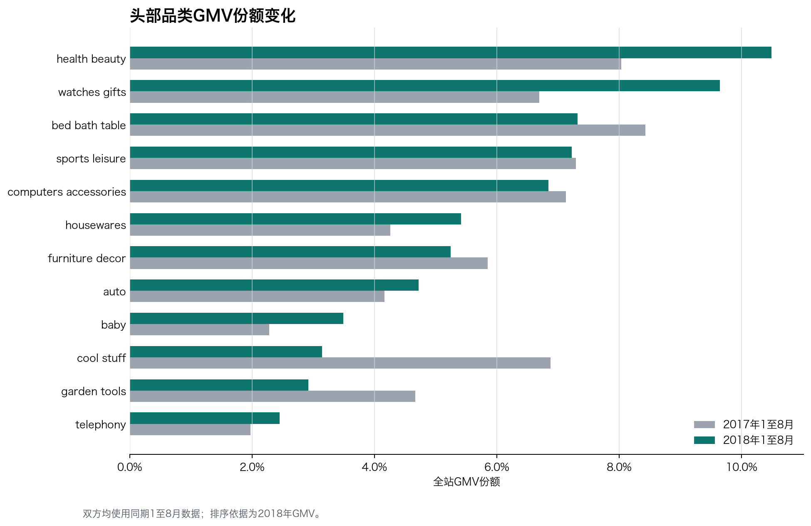

# 品类增长贡献分析

## 结论摘要

2018年1至8月GMV较2017年同期增加 4,260,186.60，增长 138.3%。增量最大的三个品类是 health beauty、watches gifts、sports leisure。

前五个增长贡献品类合计贡献全站净增量的 44.4%。该指标衡量增量集中度，并不等于2018年GMV份额。

商品件数同比增长 139.0%，平均件单价变化 -0.3%。从总量看，GMV增长主要来自售出件数扩大，件单价变化较小。

GMV份额提升最多的品类是 watches gifts，提升 3.0%；份额下降最多的是 cool stuff，下降 3.7%。

## GMV增长贡献前10名

| 品类 | 2017年GMV | 2018年GMV | GMV增量 | 同比 | 增长贡献 | 2018年份额 |
|---|---:|---:|---:|---:|---:|---:|
| health beauty | 247,457.95 | 770,002.81 | 522,544.86 | 211.2% | 12.3% | 10.5% |
| watches gifts | 206,284.44 | 708,305.95 | 502,021.51 | 243.4% | 11.8% | 9.6% |
| sports leisure | 224,596.75 | 530,182.18 | 305,585.43 | 136.1% | 7.2% | 7.2% |
| computers accessories | 219,638.68 | 502,432.09 | 282,793.41 | 128.8% | 6.6% | 6.8% |
| bed bath table | 259,621.24 | 537,514.13 | 277,892.89 | 107.0% | 6.5% | 7.3% |
| housewares | 131,132.61 | 397,688.06 | 266,555.45 | 203.3% | 6.3% | 5.4% |
| auto | 128,278.06 | 346,632.44 | 218,354.38 | 170.2% | 5.1% | 4.7% |
| furniture decor | 180,301.14 | 385,312.01 | 205,010.87 | 113.7% | 4.8% | 5.2% |
| baby | 70,328.57 | 256,086.70 | 185,758.13 | 264.1% | 4.4% | 3.5% |
| construction tools construction | 3,511.49 | 124,349.41 | 120,837.92 | 3441.2% | 2.8% | 1.7% |

## 高增长品类（2017年同期GMV不低于 10,000）

| 品类 | 2017年GMV | 2018年GMV | GMV同比 | 件数同比 |
|---|---:|---:|---:|---:|
| home appliances 2 | 12,470.82 | 86,902.86 | 596.9% | 196.0% |
| home appliances | 14,232.62 | 56,150.41 | 294.5% | 185.9% |
| baby | 70,328.57 | 256,086.70 | 264.1% | 186.8% |
| stationery | 37,276.56 | 135,468.72 | 263.4% | 294.1% |
| watches gifts | 206,284.44 | 708,305.95 | 243.4% | 330.7% |

## GMV下降品类

| 品类 | 2017年GMV | 2018年GMV | GMV变化 | 同比 |
|---|---:|---:|---:|---:|
| market place | 15,190.73 | 7,565.57 | -7,625.16 | -50.2% |
| tablets printing image | 5,157.75 | 1,267.96 | -3,889.79 | -75.4% |
| fashion male clothing | 4,870.87 | 2,301.87 | -2,569.00 | -52.7% |
| dvds blu ray | 3,012.69 | 1,132.71 | -1,879.98 | -62.4% |
| fashio female clothing | 1,696.50 | 616.66 | -1,079.84 | -63.6% |

## 口径与解读边界

- 比较期间固定为2017年与2018年的1至8月，避免不完整月份干扰。
- GMV为有效订单商品金额，不含运费，不代表平台收入或利润。
- 增长贡献按净增量计算；如果存在下降品类，正增长品类贡献之和可能超过100%。
- 一笔订单可含多个品类，各品类订单数不能直接加总为全站订单数。
- 增速排名排除2017年同期GMV低于10,000的低基数品类。
- 本章确定增长来源，但不能单独证明促销、供给或用户需求是因果驱动。

数据来源：[Brazilian E-Commerce Public Dataset by Olist](https://www.kaggle.com/datasets/olistbr/brazilian-ecommerce)。
