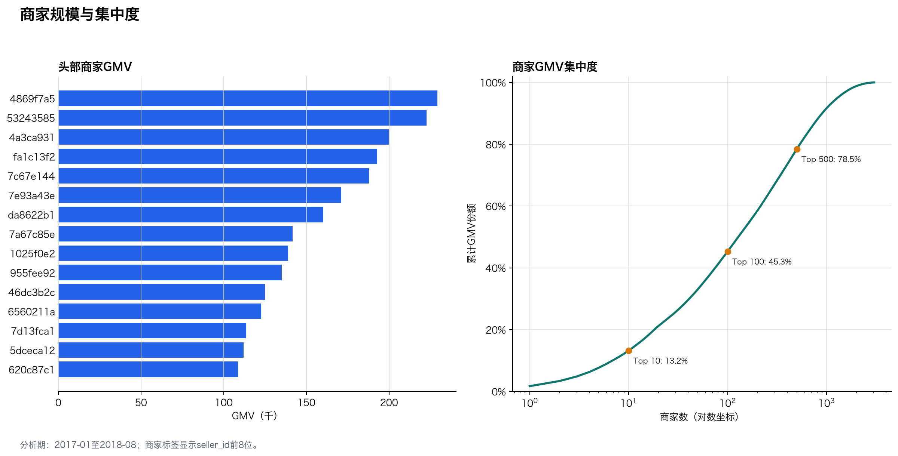

# 商家规模与履约分析

## 结论摘要

分析期内共有 3,029 家活跃商家。Top 10商家贡献 13.2% 的GMV，Top 100贡献 45.3%。

商家GMV的HHI为 0.0036，头部依赖风险较低，但长尾商家管理成本较高。

在至少100笔订单的商家中，延迟率与平均评分的相关系数为 -0.47，可作为履约治理的优先级线索。

## GMV前10名商家

| 商家ID | 州 | GMV | 订单 | GMV份额 | 延迟率 | 平均评分 |
|---|---|---:|---:|---:|---:|---:|
| 4869f7a5dfa277a7dca6462dcf3b52b2 | SP | 229,237.63 | 1,131 | 1.7% | 11.6% | 4.14 |
| 53243585a1d6dc2643021fd1853d8905 | BA | 222,776.05 | 358 | 1.7% | 4.3% | 4.13 |
| 4a3ca9315b744ce9f8e9374361493884 | SP | 200,326.12 | 1,804 | 1.5% | 11.0% | 3.83 |
| fa1c13f2614d7b5c4749cbc52fecda94 | SP | 192,842.13 | 584 | 1.4% | 10.2% | 4.34 |
| 7c67e1448b00f6e969d365cea6b010ab | SP | 187,923.89 | 982 | 1.4% | 10.1% | 3.49 |
| 7e93a43ef30c4f03f38b393420bc753a | SP | 171,184.88 | 331 | 1.3% | 5.7% | 4.25 |
| da8622b14eb17ae2831f4ac5b9dab84a | SP | 160,236.57 | 1,314 | 1.2% | 7.6% | 4.18 |
| 7a67c85e85bb2ce8582c35f2203ad736 | SP | 141,715.54 | 1,159 | 1.1% | 5.9% | 4.25 |
| 1025f0e2d44d7041d6cf58b6550e0bfa | SP | 138,968.55 | 915 | 1.0% | 10.1% | 3.99 |
| 955fee9216a65b617aa5c0531780ce60 | SP | 135,159.70 | 1,286 | 1.0% | 7.8% | 4.16 |

## 规模商家中的履约风险

| 商家ID | 订单 | GMV | 延迟率 | 平均评分 | 低评率 |
|---|---:|---:|---:|---:|---:|
| 06a2c3af7b3aee5d69171b0e14f0ee87 | 392 | 36,408.95 | 23.1% | 3.99 | 16.8% |
| 1ca7077d890b907f89be8c954a02686a | 115 | 13,341.57 | 22.2% | 2.33 | 61.4% |
| 88460e8ebdecbfecb5f9601833981930 | 247 | 31,396.65 | 19.5% | 3.42 | 30.9% |
| e5a3438891c0bfdb9394643f95273d8e | 223 | 7,711.05 | 18.5% | 3.92 | 19.5% |
| cd68562d3f44870c08922d380acae552 | 124 | 18,370.70 | 18.0% | 3.97 | 17.9% |

## 建议

- 对高GMV、高延迟、低评分商家设置联合预警，优先治理对用户体验影响最大的部分。
- 平台不存在单一头部商家过度依赖，运营机制应更关注长尾商家的准入、分层和履约质量。

## 口径与边界

- 同一订单可包含多个商家，商家订单数不能直接加总为全站订单数。
- 商家履约指标在seller_id + order_id去重后计算，避免多商品明细放大订单。
- HHI基于商家GMV份额平方和，只反映本数据集中的销售集中度。
